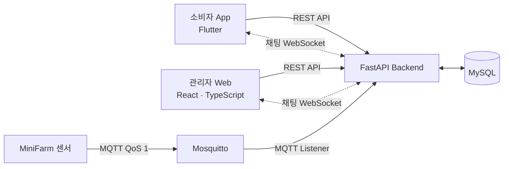
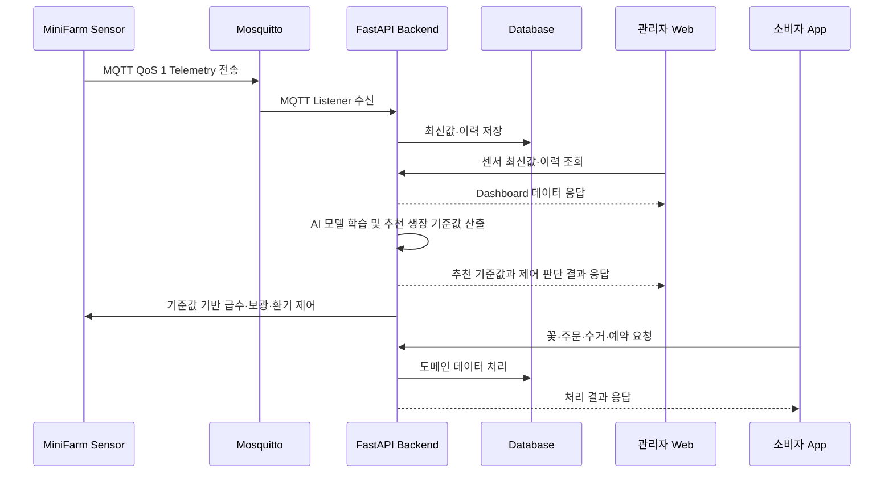
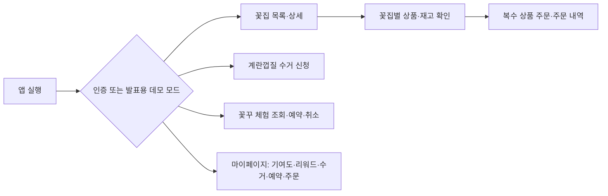
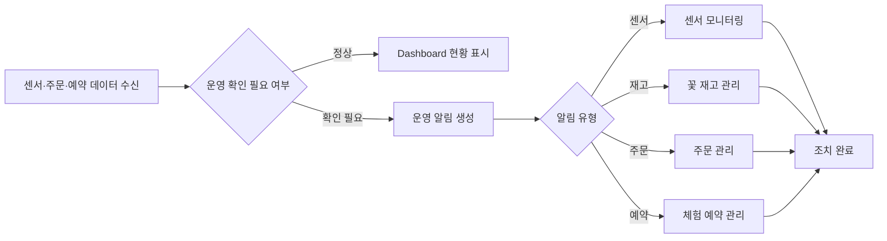
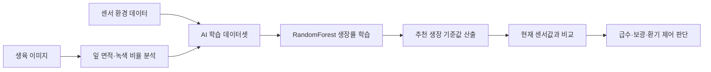

# BLOOM:IN 

팀 닮은살걀 Dalmegg

> **도심 유휴상가를 가변형 MiniFarm으로 전환하고, 화훼의 생육 관리부터 지역 유통·판매까지 연결하는 스마트팜 통합 플랫폼**

닮은살걀은 도시의 유휴공간을 소규모 화훼 생산 공간으로 전환하는 MiniFarm 서비스입니다. 운영자는 관리자 웹에서 재배 환경, 꽃 상품·재고, 체험 예약을 관리하고, AI 생육 최적화 프로토타입으로 학습 데이터 기반의 적정 생장 기준값과 하드웨어 제어 기준을 확인합니다. 소비자는 모바일 앱에서 꽃을 주문하고 계란껍질 수거 및 꽃꾸 체험에 참여합니다. Backend는 두 서비스와 MiniFarm 센서 데이터를 연결합니다.

**Final MVP의 검증 목표는 센서 데이터 한 건이 MiniFarm에서 Backend·Database를 거쳐 관리자 웹에 표시되는 end-to-end 흐름과, 소비자 주문·수거·체험 예약의 핵심 서비스 흐름을 확인하는 것입니다.**

## 목차

- [1. 프로젝트 소개](#1-프로젝트-소개)
- [2. 상세 설계](#2-상세-설계)
- [3. 개발 결과](#3-개발-결과)
- [4. 실행 및 검증](#4-실행-및-검증)
- [5. 시연 영상](#5-시연-영상)
- [6. 팀 소개](#6-팀-소개)
- [7. 해커톤 참여 후기](#7-해커톤-참여-후기)

---

## 1. 프로젝트 소개

### 1.1 개발 배경 및 문제 정의

2026년 2분기 중대형 상가 공실률은 **14.3%**로 2025년 1분기보다 **1.1%p** 높아졌고, 소규모 상가 공실률도 **8.5%**로 집계되었습니다.[^vacancy] 유휴상가는 전기·수도·접근성과 같은 기반 시설을 갖춘 경우가 많지만, 공간별 면적과 구조가 달라 획일적인 스마트팜을 적용하기 어렵습니다. 또한 재배 설비를 설치한 뒤에도 생육 환경 관리, 생산물 관리, 판매처 확보, 주문·재고 관리가 분리되어 있으면 소규모 운영자가 지속적으로 운영하기 어렵습니다.

닮은살걀은 이 문제를 다음과 같이 해결합니다.

- 공간 조건에 맞춰 구성할 수 있는 **가변형 MiniFarm**을 제안합니다.
- 센서 데이터를 수집해 운영자가 재배 환경을 확인할 수 있게 합니다.
- 화훼 생산물을 지역 소비자와 연결해 짧은 유통 구조를 설계합니다.
- 계란껍질 수거 기여와 꽃꾸 체험을 연결해 자원순환 참여 경험을 제공합니다.

### 1.2 개발 목표 및 주요 내용

프로젝트의 목표는 단일 재배 장비가 아니라 **공간 전환 → 재배 → 관리 → 생산 → 유통 → 판매**를 연결하는 도심형 MiniFarm 운영 플랫폼을 만드는 것입니다.

| 구분 | 주요 내용 |
| --- | --- |
| 소비자 앱 | 회원 인증, 꽃 조회·주문, 계란껍질 수거 신청, 꽃꾸 체험 조회·예약, 기여도·리워드 조회 |
| 관리자 웹 | 관리자 인증, 운영 Dashboard, 센서 최신값·이력 조회, 꽃 상품·재고·주문 관리, 수거 요청 승인·반려, 체험 프로그램 개설·예약 관리, 운영 알림 |
| Backend | REST/WebSocket API, JWT 권한 관리, 주문·예약·수거·리워드 도메인, MQTT 센서 데이터 처리, AI 생육 학습 Prototype API |
| MiniFarm 연동 | MQTT 센서 Telemetry 수신 → Database 저장 → 관리자 웹 조회 |

### 1.3 화훼를 적용 분야로 선택한 이유

화훼는 제한된 도심 공간에서도 상품 가치를 만들기 적합하고, 꽃집·플라워숍·행사 등 도심 내 소비처가 명확합니다. 농촌진흥청의 2024년도 농산물소득조사 결과에서 장미의 10a당 소득은 **1,383만 원**으로 제시되었습니다.[^rose-income] 또한 신선도가 중요한 상품이므로 **도심 생산 → 지역 유통 → 지역 소비**의 짧은 공급망을 검증하기에 적합합니다. 화훼는 프로젝트의 최종 목적이 아니라 MiniFarm의 생산·유통 모델을 구체화하는 첫 적용 분야입니다.

### 1.4 기존 서비스 대비 차별성

기존 스마트팜이 재배 환경 모니터링 또는 자동 제어에 집중하고, 화훼 판매·체험 서비스가 각각 분리되는 경우가 많다면, 닮은살걀은 아래 요소를 하나의 운영 흐름으로 연결합니다.

1. **가변형 공간 전환**: 유휴상가의 구조에 맞춘 MiniFarm 설치를 지향합니다.
2. **데이터 기반 운영**: 센서 데이터를 MQTT로 수집하고, Backend와 관리자 웹에서 최신값과 이력을 조회합니다.
3. **AI 생육 최적화**: 생육 이미지와 환경 데이터를 학습해 적정 온도·습도·토양 수분·조도 기준값을 산출하고, 이를 하드웨어 제어 기준으로 활용합니다.
4. **생산 이후의 판로 연결**: 화훼 상품·재고 관리와 소비자 주문·체험 예약을 서비스 안에서 지원합니다.
5. **자원순환 참여**: 계란껍질 수거 신청·기여도·리워드 기능으로 소비자의 참여 흐름을 설계합니다.

### 1.5 사회적 가치

- **도심 공간 재생**: 유휴상가를 생산·체험 공간으로 전환하는 모델을 제시합니다.
- **자원순환 참여**: 계란껍질 수거와 기여도·리워드를 연결해 친환경 활동의 참여 경험을 만듭니다.
- **지역 상권 연결**: 지역에서 생산한 화훼를 가까운 소비자와 연결해 지역 내 생산·소비 구조를 지향합니다.
- **창업·교육 확장성**: MiniFarm 설치, 운영 교육, 유지보수 서비스로 확장 가능한 기반을 마련합니다.

---

## 2. 상세 설계

### 2.1 시스템 구성도



센서 연동의 주요 흐름은 **Sensor → MQTT → Backend → Database → 관리자 웹 조회**입니다.

### 2.2 사용 기술

| 영역 | 기술 |
| --- | --- |
| 소비자 앱 | Flutter, Dart, Provider, HTTP |
| 관리자 웹 | React 19, TypeScript, Vite, Tailwind CSS, React Router, Zustand, Recharts |
| Backend | Python 3.10+, FastAPI, Pydantic, SQLAlchemy Async |
| Database | MySQL (`asyncmy`), 테스트 환경 SQLite (`aiosqlite`) |
| 인증 | JWT, `python-jose`, `passlib[bcrypt]` |
| IoT 데이터 | MQTT, `aiomqtt` |
| 검증 | pytest, pytest-asyncio, httpx, ESLint, TypeScript |
| 컨테이너 | Docker, Mosquitto (개발용 MQTT Broker) |

### 2.3 AI 생육 기준 학습과 하드웨어 제어

AI 생육 최적화 프로토타입은 센서 환경값과 생육 이미지 데이터를 학습해 꽃의 성장에 유리한 기준값을 산출합니다. 기본 운영 화면은 현재값과 설정 범위를 비교하고, AI 학습 결과는 온도·습도·토양 수분·조도 추천값과 하드웨어 제어 기준으로 사용합니다.

| 학습 입력 | 내용 |
| --- | --- |
| 환경 데이터 | 온도, 습도, 토양 수분, 조도 |
| 이미지 분석값 | 잎 면적, 녹색 비율, 황변 비율 |
| 생육 결과값 | 생장률, 생육 점수 |

학습 모델은 생장률을 예측하고, 후보 환경 조건을 탐색해 가장 높은 생장률이 예상되는 조합을 추천합니다. 추천 결과는 재배 기준값으로 저장되며, 센서 현재값이 기준에서 벗어나면 급수, 환기·냉난방, 보광 같은 하드웨어 제어 판단에 활용됩니다.

| 산출 결과 | 활용 |
| --- | --- |
| 추천 온도 | 냉난방·환기 제어 기준 |
| 추천 습도 | 가습·환기 제어 기준 |
| 추천 토양 수분 | 급수 펌프 제어 기준 |
| 추천 조도 | 보광등 제어 기준 |
| Feature Importance | 어떤 환경 요소가 생육에 크게 작용했는지 설명 |

### 2.4 데이터 흐름



센서 Telemetry는 온도, 습도, 토양 수분, 조도, 수위 등의 값을 지원합니다. Backend는 중복 메시지를 차단하고, 최신 센서값과 일정 간격의 이력을 분리하여 저장합니다.

### 2.5 공간 맞춤형 모듈 구성

유휴상가마다 면적, 층고, 출입구·전력·수도 위치가 다르므로, 동일한 재배 모듈을 공간 조건에 맞춰 조립하는 방식을 제안합니다.

| 구성 예시 | 적용 공간 | 특징 |
| --- | --- | --- |
| 3단 적층 | 폭은 좁고 층고가 충분한 공간 | 수직 활용으로 재배 면적 확보 |
| 2단 수평 | 층고가 낮거나 동선이 필요한 공간 | 작업·출입 동선 확보 |
| ㄱ자 배치 | 코너나 비정형 공간 | 벽면을 활용해 재배 모듈 배치 |

이는 고정 규격 스마트팜을 일괄 설치하는 방식과 달리, 공실의 실제 조건에 맞춰 MiniFarm의 규모와 배치를 조정하기 위한 설계입니다.

### 2.6 데이터 신뢰성과 예외 처리 원칙

시연 데이터와 실제 운영 데이터를 혼동하지 않도록 아래 원칙을 적용했습니다.

| 상황 | 사용자에게 제공하는 방식 |
| --- | --- |
| Backend와 센서가 정상 연결됨 | 실제 API와 최근 저장 센서값을 우선 표시 |
| API 응답이 비어 있거나 기기가 등록되지 않음 | 빈 상태 또는 하드웨어 연결 확인 안내 표시 |

또한 Backend는 JWT 기반으로 사용자와 관리자의 권한을 분리하고, Access/Refresh Token을 별도로 발급합니다. 로그아웃·갱신된 Token은 폐기 목록으로 관리합니다.

---

## 3. 개발 결과

### 3.1 소비자 앱

Flutter 기반 소비자 앱은 다음 흐름을 제공합니다.



- 인증 토큰은 Keychain / Keystore 기반 보안 저장소에 보관하며, Access Token 만료 시 Refresh Token으로 한 번 갱신합니다.

### 3.2 관리자 웹

관리자 웹은 MiniFarm 운영자가 재배 환경과 판매·체험 업무를 한 화면에서 관리하는 서비스입니다. 모든 시간 표시는 한국 표준시(KST, `Asia/Seoul`) 기준으로 통일했습니다.

| 메뉴 | 구현 기능 |
| --- | --- |
| Dashboard | 센서 현재값, 재고·예약 현황, 확인이 필요한 운영 알림을 표시합니다. 미조치 알림은 처음 3건만 표시하고 `더보기`로 전체를 확인하며, 조치 완료를 바로 처리할 수 있습니다. |
| 센서 모니터링 | 온도·습도·조도·토양 수분의 최신값과 24시간 이력을 조회합니다. 조도는 센서 측정값을 표시하되 고정 정상 범위 비교에서 제외했습니다. |
| 꽃 재고 관리 | 꽃 상품 CRUD, 이미지 업로드, 재고 조정을 지원합니다. |
| 주문 관리 | 주문 고객·품목·금액·접수 시각을 조회합니다. API의 `flower_name`으로 실제 꽃 이름을 표시하며, `수령 대기`와 `수령 완료` 탭을 분리하고 탭별 20건 단위 페이지네이션을 제공합니다. |
| 수거 요청 관리 | 앱에서 접수된 계란껍질 수거 요청의 장소·메모·첨부 사진을 상세 확인하고 승인 또는 반려합니다. 목록에서는 사진을 노출하지 않습니다. |
| 체험 예약 관리 | 체험 프로그램을 개설하고, 프로그램별 예약 현황·신청자·예약 상태를 조회·관리합니다. |
| 운영 알림 | 새 꽃 주문과 체험 예약을 주기적으로 확인해 상단 알림과 Dashboard 운영 알림에 표시합니다. 주문 알림은 주문 관리 화면, 예약 알림은 체험 예약 관리 화면으로 연결됩니다. |

주요 경로는 `/dashboard`, `/sensors`, `/flowers`, `/orders`, `/collections`, `/reservations`입니다.

#### 운영자 이상 대응 흐름




### 3.3 Backend 및 IoT 연동

Backend는 사용자 앱, 관리자 웹, Database, MiniFarm 센서를 연결합니다.

- 사용자·관리자 권한을 JWT로 분리하고, Access/Refresh Token과 폐기 목록을 관리합니다.
- 꽃집, 꽃 상품, 이미지, 재고 조정 이력, 주문, 체험 예약, 수거 기여도·리워드 등 핵심 도메인을 제공합니다.
- 맞춤 부케와 사용자·관리자 1:1 채팅 REST/WebSocket API를 제공합니다.
- MQTT QoS 1로 `dalmegg/v1/farms/{farm_uid}/devices/{device_uid}/telemetry` Topic을 구독해 센서 데이터를 저장하고, 관리자 전용 API로 조회합니다.

#### 주요 API 범위

| API 그룹 | 제공 기능 |
| --- | --- |
| `/api/auth`, `/api/admin/auth` | 사용자·관리자 인증과 Token 갱신 |
| `/api/shops`, `/api/flowers` | 꽃집, 꽃 상품, 이미지, 재고 |
| `/api/orders`, `/api/admin/orders` | 일반 주문과 관리자 주문 조회. 관리자 주문 응답의 품목에는 `flower_name`을 포함해 실제 꽃 이름을 표시 |
| `/api/programs`, `/api/reservations` | 꽃꾸 프로그램 개설·조회와 예약 조회·상태 관리 |
| `/api/bouquet-orders`, `/api/chat` | 맞춤 부케, 사용자·관리자 1:1 채팅 REST/WebSocket |
| `/api/eco`, `/api/collections` | 계란껍질 수거, 기여도, 리워드. 관리자는 대기 요청 조회 후 승인·반려 처리 |
| `/api/dashboard`, `/api/admin/sensors` | 운영 Dashboard, 센서 Device·최신값·이력 조회 |

#### 센서 수집·조회 규칙

| 단계 | 처리 내용 |
| --- | --- |
| 수집 | MQTT Listener가 농장·기기별 Telemetry Topic을 구독 |
| 검증 | `message_id` 중복을 차단하고 입력 값을 검증 |
| 저장 | 최신값은 `sensor_latest`, 이력은 `sensor_reading`, 수신 이력은 `sensor_message_log`에 분리 저장 |
| 조회 | 관리자 JWT 인증 후 Device 목록, 최신값, 이력을 조회 |

기본 센서 이력 저장 간격은 60초입니다.

### 3.4 AI 생육 최적화 프로토타입

AI 생육 최적화 프로토타입은 MiniFarm의 환경 데이터와 생육 이미지 데이터를 학습해 적정 생장 기준값을 산출하는 Backend 기능입니다. Mock 생육 데이터와 카메라 기반 이미지 분석 데이터를 함께 사용할 수 있고, 학습 결과는 하드웨어 제어 기준으로 연결됩니다.

| 항목 | 내용 |
| --- | --- |
| 데이터 생성 | Mock 생육 샘플 생성, 카메라 이미지 업로드 |
| 이미지 분석 | OpenCV 기반 잎 면적, 녹색 비율, 황변 비율 추출 |
| 학습 모델 | RandomForestRegressor |
| 학습 입력 | 온도, 습도, 토양 수분, 조도, 녹색 비율 |
| 학습 출력 | 추천 온도, 추천 습도, 추천 토양 수분, 추천 조도, 예상 생장률 |
| 제어 활용 | 추천 기준값과 현재 센서값을 비교해 급수 펌프, 보광등, 환기·냉난방 제어 기준으로 사용 |

프로토타입 API는 `/api/v1/ai-prototype` 범위에서 Mock 데이터 생성, 생육 샘플 조회, 모델 학습, 학습 이력 조회, 이미지 업로드와 이미지 분석 흐름을 제공합니다. 학습 실행 결과에는 샘플 수, 모델 성능 지표, Feature Importance, 추천 생장 조건이 포함됩니다.



### 3.5 AI 활용 및 검증 책임

AI는 개발자의 의사결정을 대체하지 않고, UI/UX 초안, 코드 분석·리팩터링, API 연동 점검, 테스트와 문서 정리에 보조적으로 활용했습니다.

- AI 제안은 요구사항, API Contract, Model, 코딩 규칙과 대조한 뒤 작은 단위로 반영했습니다.
- 반영 전후에는 변경 범위를 검토하고, Backend API·UI 상태·수치를 사람이 다시 확인했습니다.
- 실서비스 Database 접속 정보와 운영용 Secret Key는 AI Prompt나 Repository에 포함하지 않았습니다.
- AI가 보조한 코드도 테스트·정적 분석·팀원 검토를 거친 뒤 반영했습니다.

상세 활용 내역은 [AI 활용 및 고도화 문서](docs/ai-usage.md)에서 확인할 수 있습니다.

### 3.6 검증 결과

| 대상 | 검증 | 결과 |
| --- | --- | --- |
| Backend | pytest (인증, 주문·재고, 예약, 채팅, 수거·리워드, Dashboard, MQTT 등) | **53 passed, 1 skipped** |
| 관리자 웹 | `npm run typecheck` | 통과 |
| 관리자 웹 | `npm run lint` | 통과 |
| 관리자 웹 | `npm run build` | 통과 |
| 소비자 앱 | `flutter analyze` | 통과 |
| 소비자 앱 | `flutter test -j 1` | **9 passed** |
| 소비자 앱 | Android Debug APK Build | 통과 |

`pytest`의 Skip 1건은 실제 MySQL 연결이 불가능한 경우 건너뛰도록 작성된 Database 연결 테스트입니다. Web은 정적 검사·Production Build와 주요 화면의 수동 동선 점검으로 검증했습니다. 최근 관리자 웹 변경 후에도 `npm run typecheck`, `npm run build`를 재실행해 통과를 확인했습니다.

### 3.7 프로토타입 시연 범위

발표 시연은 아래의 여섯 단계를 기준으로 구성합니다.

1. 프로토타입 전원 인가
2. 온도·습도·조도·토양 수분 4종 환경값 측정
3. MQTT 수신 로그 확인
4. 관리자 웹의 센서 최신값·이력 표시
5. AI 생육 최적화 프로토타입의 추천 기준값과 제어 판단 확인
6. 급수 펌프 동작 확인

시연 검증 범위는 MQTT 수신, Database 저장, 관리자 웹 조회, AI 생육 학습 결과의 추천 기준값 산출과 제어 판단 확인입니다.

---

## 4. 실행 및 검증

### 4.1 디렉터리 구조

```text
.
├── app/                    # Flutter 소비자 앱
├── backend/
│   ├── app/
│   │   ├── api/routes/     # FastAPI Endpoint
│   │   ├── core/           # 설정, JWT, Password
│   │   ├── crud/           # Database Query
│   │   ├── db/             # Engine, Session, Base
│   │   ├── models/         # SQLAlchemy Model
│   │   ├── mqtt/           # MQTT Listener
│   │   ├── schemas/        # Request / Response Schema
│   │   └── services/       # Domain Business Logic
│   └── tests/              # Backend Test Suite
├── web/
│   └── src/
│       ├── api/            # API Client
│       ├── components/     # 공통 UI
│       ├── mock/           # Demo Data
│       ├── pages/          # Route 화면
│       ├── routes/         # React Router
│       └── store/          # Zustand Store
└── docs/                   # 기획·구현 기준 문서
```

### 4.2 Backend

MySQL 접속 정보는 `backend/.env`에 별도로 설정해야 합니다. 개발용 Docker Compose에는 Backend와 Mosquitto만 포함되며 Database Container는 포함되지 않습니다.

```bash
cd backend
python3.10 -m venv .venv
source .venv/bin/activate
pip install -r requirements.txt
uvicorn main:app --reload --host 0.0.0.0 --port 8000
```

테스트는 아래와 같이 실행합니다.

```bash
cd backend
pytest -q
```

### 4.3 관리자 웹

```bash
cd web
npm install
npm run dev
```

로컬 Backend 연결은 `web/.env.local`에 설정합니다.

```dotenv
VITE_API_BASE_URL=http://localhost:8000
VITE_USE_MOCKS=false
```

정적 검사와 Production Build는 다음 명령으로 실행합니다.

```bash
npm run typecheck
npm run lint
npm run build
```

### 4.4 소비자 앱

API 주소는 `/api`를 제외한 Backend Origin을 지정합니다. Android Emulator에서 로컬 Backend를 사용할 때는 `http://10.0.2.2:8000`을 사용합니다.

```bash
cd app
flutter pub get
flutter run --dart-define=API_BASE_URL=http://10.0.2.2:8000
```

다른 서버를 사용할 경우 다음과 같이 지정합니다.

```bash
flutter run --dart-define=API_BASE_URL=https://example.com
```

```bash
flutter analyze
flutter test -j 1
```

---

## 5. 시연 영상

https://youtu.be/OQ_yT2TUmz8?si=Ju4aZqnTFqD3V2lm

시연은 다음 순서로 구성합니다.

1. 관리자 로그인 후 MiniFarm Dashboard와 센서 이력 확인
2. 꽃 상품·재고 및 꽃꾸 체험 예약 관리
3. 소비자 앱의 꽃 조회·주문, 계란껍질 수거 신청, 체험 예약
4. MQTT 센서 데이터가 Backend를 거쳐 관리자 웹에 표시되는 흐름

---

## 6. 팀 소개

### Team 닮은살걀

| 이도원 | 이예은 | 이예람 | 김태우 |
| --- | --- | --- | --- |
| 팀장 / 기획 | 프론트엔드 (Web) | 프론트엔드 (App) | 인프라·데이터·Backend |
| 프로젝트 총괄, 스마트팜 현장 기획 | React 기반 관리자 웹 UI·Dashboard 연동 | Flutter 기반 소비자 앱·지역 거래 흐름 | Docker 인프라, DB 설계, FastAPI API 개발 |

---

## 7. 해커톤 참여 후기

| 구성원 | 후기 |
| --- | --- |
| 이도원 | 이번 창의융합 SW 해커톤에서는 지정과제 트랙의 팀장을 맡아 약 4개월 동안 도심 유휴공간을 활용한 스마트팜 ‘BLOOM:IN’을 기획했습니다. 팀원들과 앱, 웹, 하드웨어, 비료까지 직접 구현하며 아이디어를 실제 결과물로 만들어 보았습니다. 특히 스마트팜을 직접 만들고 다양한 식물을 키워본 경험이 기억에 남습니다. 평소 식물을 잘 키우지 못했는데, 직접 만든 스마트팜에서 식물들이 잘 자라는 모습을 보며 뿌듯함을 느꼈습니다. 또한 전공자 팀원들과 협업하며 AI와 개발에 대해서도 많이 배웠습니다. 이전에는 기획자로서 개발 지식이 부족해 소통에 아쉬움이 있었지만, 이번에는 개발 과정을 가까이에서 접하고 AI를 자료조사와 PPT 제작 등에 활용하며 그 간격을 조금이나마 좁힐 수 있었습니다. 서로 다른 전공의 팀원들과 하나의 결과물을 완성하며 새로운 분야를 배우고 성장할 수 있었던 뜻깊은 경험이었습니다. |
| 이예은 | 저는 관리자 웹 개발을 맡아 센서 모니터링부터 꽃 재고, 주문, 수거 요청, 체험 예약까지 스마트팜 운영에 필요한 기능을 하나의 흐름으로 연결했습니다. 센서 데이터가 MQTT와 백엔드를 거쳐 웹에 표시되고 급수 펌프와 같은 장치 제어로 이어지는 과정을 확인하며, 화면 개발에도 하드웨어와 데이터 흐름에 대한 이해가 중요하다는 것을 배웠습니다. 또한 스마트팜이 단순한 재배 기술이 아니라 생산, 운영, 판매와 사용자 경험이 함께 연결되는 분야라는 점을 탐구할 수 있었습니다. 새로운 분야의 요구사항을 실제 서비스 화면으로 구체화했다는 점에서 의미 있는 경험이었습니다. |
| 이예람 | 이번 해커톤에서는 Flutter를 활용한 소비자 앱 개발을 중점적으로 맡아 로그인, 꽃 주문, 체험 예약 등 주요 기능을 구현하고 백엔드 API와 연동하는 전 과정을 경험했습니다. 특히 디자이너가 없는 상황에서 AI를 활용해 앱 UI뿐만 아니라 배너, 발표 자료, 시연 영상까지 직접 제작하며 짧은 시간 안에도 비교적 완성도 높은 결과물을 만들어낼 수 있었습니다. 또한 스마트팜이라는 새로운 분야를 탐구하며 센서 데이터, 재배 환경, 지역 유통과 자원순환이 하나의 서비스로 연결되는 과정을 이해할 수 있어 뜻깊었습니다. |
| 김태우 | 센서에서 측정된 데이터가 서버를 거쳐 실제 서비스 화면에 나타나는 과정을 직접 구축한 것이 가장 인상 깊었습니다. 온도, 습도, 조도, 토양 수분을 수집하는 하드웨어부터 MQTT 통신, 데이터베이스, 백엔드 API까지 연결하면서 스마트팜 시스템의 전체 구조를 이해할 수 있었습니다. 인증, 주문, 예약, 재고, 수거처럼 서로 다른 기능을 하나의 백엔드에서 안정적으로 동작하게 만드는 과정에서는 데이터 설계와 통합 테스트의 중요성도 배웠습니다. AI를 활용해 생소한 기술을 빠르게 학습하고 오류를 분석하며 개발 효율을 높일 수 있었고, 하드웨어와 소프트웨어를 결합해 실제 작동하는 결과물을 완성했다는 점에서 뜻깊은 경험이었습니다. |

---

## 참고 문서

- [프로젝트 통합 기준 문서](docs/PROJECT_MASTER.md)
- [AI 활용 및 고도화](docs/ai-usage.md)
- [소비자 앱 실행 안내](app/README.md)
- [관리자 웹 실행 안내](web/README.md)

[^vacancy]: 한국부동산원, 「2026년 2분기 상업용부동산 임대동향조사」, 2026. 7. 30. 발표.
[^rose-income]: 농촌진흥청, 「2024년도 농산물소득조사 결과」, 2025. 9. 30. 발표.
