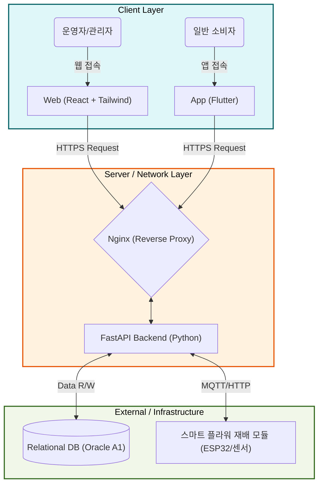
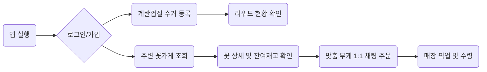
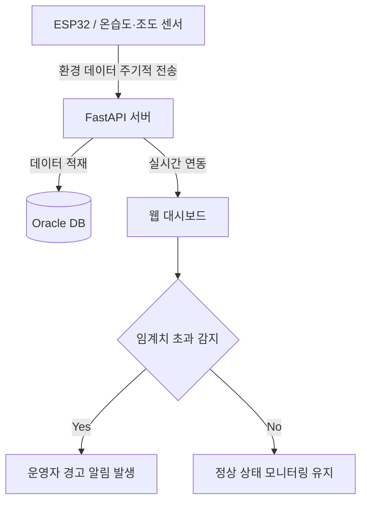
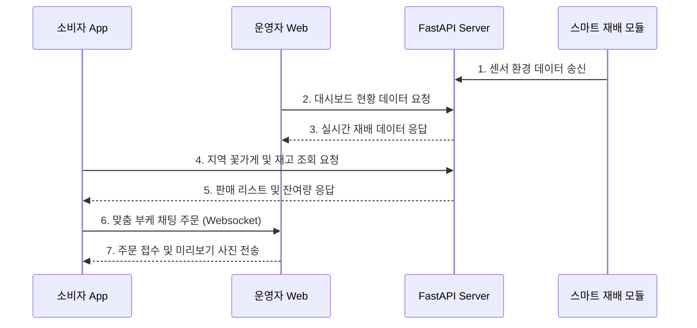
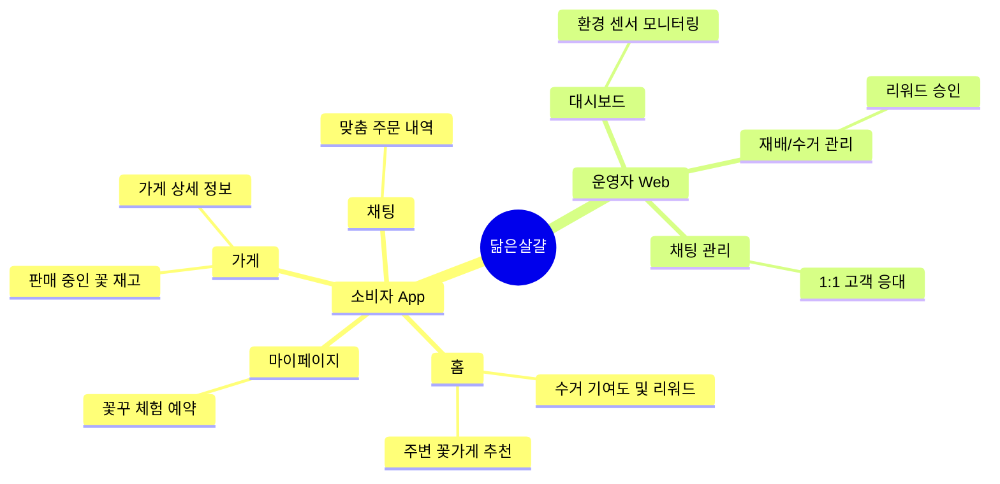

# 닮은살걀: 순환형 스마트 플라워팜 통합 플랫폼

> 가정 내 폐기물을 활용한 자원순환부터 꽃 재배, 지역 거래, 꽃꾸 체험까지 하나로 연결되는 도심형 스마트 농업 생태계
> 

## 1. 프로젝트 배경

### 1.1 국내외 (시장)현황 및 문제점

- **도심 공실 증가와 스마트팜의 진입 장벽**
최근 기후변화와 도심 공동화 현상으로 인해 도심 내 유휴공간 및 빈 상가가 지속적으로 증가하고 있다. 이를 해결하기 위해 도심형 스마트팜이 대안으로 부각되며 시장이 급성장하고 있으나, 기존 스마트팜은 초기 설비 구축 비용이 과도하게 높고 일반 사용자가 운영하기에는 전문적인 농업 지식과 유지보수 부담이 크다는 한계가 있다. 또한 재배, 관리, 판매 과정이 분산되어 있어 소규모 창업자가 안정적인 수익을 창출하기 어려운 구조이다.
- **친환경 재배와 자원순환에 대한 관심 증가**
ESG 경영과 친환경 소비가 확산되면서 지속가능한 농업과 자원순환에 대한 관심이 높아지고 있다. 천연 부산물을 활용한 친환경 비료와 자원 재활용 기술은 환경 부담을 줄이면서도 지속가능한 재배 방식을 구현할 수 있는 대안으로 주목받고 있다.
- **화훼 시장의 DX(디지털 전환) 및 체험 소비 수요 증대**
청년층을 중심으로 반려식물 문화가 확산되고 생화를 활용한 ‘꽃꾸(꽃 꾸미기)’ 트렌드가 자리 잡으면서 꽃 소비와 DIY 체험 프로그램에 대한 수요가 증가하고 있다. 그러나 현재 화훼 산업은 복잡한 유통 구조로 인해 소비자 부담이 크고, 스마트 재배, 지역 거래, 체험 콘텐츠를 하나로 연결한 통합 플랫폼은 부족한 실정이다.

### 1.2 필요성과 기대효과

 본 프로젝트는 스마트 꽃 재배, 재배 환경 관리, 꽃꾸 체험, 지역 거래를 하나의 플랫폼으로 연결하여 도심형 스마트팜의 새로운 활용 모델을 제시한다. 사용자는 스마트 재배 시스템을 통해 꽃을 직접 재배하고, 꽃꾸 체험과 지역 기반 거래를 통해 생산과 소비를 함께 경험할 수 있다.

또한 스마트 플라워 재배 모듈을 통해 온도, 습도, 토양 수분, 조도 데이터를 수집하고 웹 대시보드와 연동하여 초보 운영자도 쉽게 재배 환경을 관리할 수 있다. 재배 가상환경 시뮬레이터를 활용해 실제 재배 전 조건별 성장 가능성을 학습할 수 있어 교육적 활용도 기대된다.

**기대효과**

- 도심 유휴공간의 생산 및 감성 체험 공간화
- 꽃 재배와 꽃꾸 체험을 통한 지역 기반 수익 창출
- 스마트 재배 모듈을 활용한 운영 난이도 감소
- 친환경 재배 문화 확산 및 ESG 가치 실현
- 환경 교육, ESG 체험 프로그램, 청년 창업 모델로 확장 가능

### 1.3 기존 서비스(상품) 대비 차별성

 기존 스마트팜 서비스는 대부분 **재배 환경 모니터링이나 자동 제어 기능**에 집중되어 있으며, 화훼 플랫폼은 **꽃 판매**, 체험 서비스는 **원데이 클래스**처럼 각각 독립적으로 운영되는 경우가 많다. 반면 본 프로젝트는 **스마트 재배, 지역 거래, 체험 콘텐츠를 하나의 플랫폼으로 통합**하여 운영할 수 있는 순환형 스마트 플라워팜 생태계를 구축한다는 점에서 차별성을 가진다.

**첫째**, 스마트 꽃 재배 모듈(ESP32 기반)과 온도·습도·토양수분·조도 센서를 활용하여 재배 환경을 실시간으로 수집하고, 운영자는 웹 대시보드에서 생육 상태를 모니터링하고 원격으로 관리할 수 있다. HW와 SW를 연계한 통합 운영 시스템을 제공한다.

**둘째**, 생산된 꽃을 단순 판매하는 것이 아니라 지역 기반 플랫폼과 연계하여 실시간 재고 조회, 맞춤 꽃다발 주문, 체험 프로그램 예약까지 하나의 서비스에서 제공한다. 이를 통해 생산-판매-체험이 연결되는 새로운 화훼 비즈니스 모델을 구현한다.

**셋째**, 웹 기반 재배 가상환경 시뮬레이터를 제공하여 사용자가 온도, 습도, 조도, 급수량 등의 조건을 직접 변경하며 꽃의 성장 결과를 미리 확인할 수 있도록 하여 교육성과 사용자 참여도를 높인다.

### 1.5. 사회적가치 도입 계획

> • **친환경 자원순환:** 버려지는 계란 껍질을 업사이클링하여 토양오염 방지 및 폐기물 감소
• **도심 공간 재생:** 방치된 공실을 화훼 재배 및 감성 체험 공간으로 가치 재창출
• **탄소 배출 저감:** 지역 기반의 직거래로 화훼 유통 단계를 축소하여 물류 탄소 발생 최소화
 
> 

---

## 2. 실현 및 구체화 계획

### 2.1 목표 및 세부내용

#### 1) 개발 목표

- 도심의 공실 및 유휴공간을 활용한 순환형 스마트팜 서비스 플랫폼 개발
- 스마트 꽃 재배 환경을 실시간으로 관리할 수 있는 운영자 웹서비스 제공
- 스마트팜에서 생산된 꽃의 지역 거래, 실시간 재고 조회, 맞춤 꽃다발(부케) 주문을 지원하는 모바일 앱 서비스 제공
- 스마트 재배 관리, 꽃 판매, 체험 예약, 운영 데이터를 통합하여 지속 가능한 도시형 스마트 화훼 플랫폼 구축

#### 2) 요구사항 분석

- **운영자 웹서비스 (스마트팜 운영자)**
    - 스마트 플라워 재배 모듈에서 송신되는 환경 데이터(온도, 습도, 토양 수분, 조도)의 실시간 모니터링 및 원격 제어
    - 꽃 재배 현황 및 생육 데이터 관리
    - 꽃꾸 체험 프로그램 관리
    - 주문 접수 알림
    - 일/월별 매출 통계 및 정산 내역 시각화 차트
- **지역 거래 앱서비스 (일반 소비자)**
    - 지역 내 스마트팜 꽃가게 및 판매 꽃 조회
    - 꽃 상세 정보 및 실시간 잔여 재고 확인
    - 꽃꾸 체험 프로그램 조회 및 예약
    - 꽃 직접 구매 및 맞춤 꽃다발(부케) 주문
    - 꽃 가게(스마트팜) 정보 및 위치 지도 확인과 1대1 실시간 문의(채팅)

#### 3) 개발 환경

- **프로그래밍 언어**
    - Frontend : Web : JavaScript + TypeScript , C# / App: Dart
    - Backend : Python
- **프레임워크**
    - Frontend : Web : React + Tailwind CSS , Unity WebGL / App: Flutter
    - Backend : FastAPI
- **기타**
    - 웹서버 : Nginx
    - 컨테이너화 : Docker
    - 클라우드서비스 : Oracle Cloud A1

#### 4) AI 도구 활용 계획

- **Claude Design: UI/UX 설계 및 가속화**
    - 비전공 기획자가 Claude Design을 활용해 아이디어를 UI로 즉시 시각화.
    - 확정된 디자인에서 React/Tailwind CSS 등 즉시 실행 가능한 UI 코드를 추출.
    - 프론트엔드 마크업 작업 시간을 최소화하여, 개발자는 핵심 비즈니스 로직 구현에 집중할 수 있는 환경 조성.
- **Claude Code: 엔지니어링 고도화**
    - 비전공자나 개발자가 작성한 로직을 AI가 실시간 리뷰하여 코딩 컨벤션에 맞게 교정.
    - 전체 코드베이스 분석을 통한 에러 원인 추적 및 리팩토링 제안으로, 기존 디버깅에 소요되던 시간을 절감시켜 전체 개발 사이클 단축.
    - 수동 테스트 대신 Claude Code를 통한 유닛/통합 테스트 코드 자동 생성 (Coverage 80% 이상 목표)
    - 개발 문서 및 API 코드 작성 지원

### 2.3 개발 및 분석 일정

- **[1] 기획 및 요구사항 분석 (1-3주)**
    - 기능 명세 구체화
    - 시스템 아키텍처 설계
    - DB 모델링
    - UI/UX 디자인
- **[2] 백엔드 구축**
    - 서버 인프라 세팅 및 API 개발
    - 데이터베이스 설계 및 기기 연동 환경 구축
- **[3] 프론트엔드 개발**
    - Web / App 레이어 UI 구현
    - 백엔드와의 실시간 데이터 통합 및 매핑
- **[4] 디버깅 및 테스트**
    - Claude Code 활용 교차 검증 및 테스트 자동화 실행
- **[5] 결과 보고서 작성 + SW 저작등록 준비**

---

## 3. 상세설계

### 3.1 시스템 구성도

---

## 4. 개발결과

### 4.1 전체시스템 흐름도

- 유저 플로우 차트
    
    > 소비자의 자원 수거 등록부터 맞춤형 꽃다발(부케) 주문까지의 흐름을 보여줍니다.
    > 

- 테스크 플로우 차트
    
    > 스마트 플라워 재배 모듈에서 수집된 센서 데이터가 서버를 거쳐 웹 대시보드에 표출되는 흐름입니다.
    > 

- 시스템 플로우 차트
    
    > 앱(Flutter)과 웹(React), 그리고 센서 장비 간의 API 데이터 통신 구조를 도식화하였습니다.
    > 

- IA(Information Architecture)
    
    > 전체 웹/앱 서비스의 메뉴 구조 및 정보 아키텍처를 보여줍니다.  
    > 

 

### 4.2 기능설명

#### 1) 수거 기여 및 리워드 시스템

- 앱을 통해 계란 껍질 수거함에 반납한 이력을 기록하고 누적 기여량을 시각화하여 확인한다.
- 달성한 리워드 등급에 따라 재배된 꽃으로 교환하거나 체험 할인권으로 사용한다.

#### 2) 가상 시뮬레이터 및 모니터링

- 운영자는 웹을 통해 실시간 온습도, 토양 수분을 체크하고 재배 일정을 관리한다.
- 소비자는 앱 내 가상 시뮬레이터를 통해 물, 온도, 빛의 양을 조절하며 꽃의 성장 상태 변화를 미리 체험할 수 있다.

#### 3) 실시간 맞춤 주문 및 지역 거래

- 실시간 재고가 연동된 동네 스마트팜의 판매 리스트를 확인하고 즉시 구매한다.
- 원하는 목적, 예산, 꽃 색상을 입력하면 운영자와의 1대1 채팅방이 열려 픽업 전 완성본 사진을 주고받으며 조율할 수 있다.

#### 4) 체험 예약 시스템 (꽃꾸)

- 생산된 꽃을 활용하는 오프라인 클래스(꽃다발 만들기, 소품 꾸미기 등) 일정을 앱에서 확인하고 간편하게 예약/결제한다.

### 4.3 기능명세서 요약

| 기능 | 사용자 | 설명 | 상태 |
| --- | --- | --- | --- |
| 자원 수거 등록/조회 | 일반 소비자 | 계란 껍질 배출 인증 및 누적 데이터 확인 | 개발 예정 |
| 통합 모니터링 대시보드 | 운영자 | 재배 모듈 센서 데이터 확인 및 제어 | 개발 예정 |
| 가상 재배 시뮬레이터 | 일반 소비자 | 환경 변수에 따른 꽃 성장 상태 예측 체험 | 개발 예정 |
| 지역 화훼 거래 및 채팅 | 일반 소비자 | 근거리 매장 꽃 구매 및 맞춤형 채팅 주문 | 개발 예정 |
| 꽃꾸 체험 및 리워드 관리 | 운영자, 소비자 | 프로그램 스케줄링, 예약 접수 및 리워드 승인 | 개발 예정 |

### 4.4 디렉토리 구조 (추후 추가 예정)

(프로젝트 개발 진행 후 최종 디렉토리 구조로 업데이트될 예정이다.)

---

## 5. 활용 방안

### 5.1 활용 계획

 본 프로젝트는 도심 내 유휴공간 및 공실 건물을 활용하여 소규모 스마트 재배 공간을 구축하고, 이를 누구나 운영 가능한 형태의 스마트 농업 모델로 확산시키는 것을 목표로 하며 농업을 넘어 축산 부산물을 활용하여 지속가능한 친환경 시스템 구축을 목표로 한다. 소규모 창업자·농업 진입 희망자·공실 건물주를 대상으로 스마트 재배 시스템 공급을 확대할 계획이다.

사용자는 계란껍질을 비료로 활용하여 꽃을 재배 하고 지역 기반 거래 플랫폼을 통해 직접 판매할 수 있도록 하여 수익 창출이 가능하도록 설계하였다.
소비자들에게는 가정에서 버려지는 계란 껍질을 배출하여 자원순환에 직접 참여하고, 이를 통해 얻은 리워드로 복잡한 유통 과정을 거치지 않은 가장 신선한 꽃을 동네에서 바로 구할 수 있는 친환경적인 화훼 소비 플랫폼으로 활용된다. 또한, 기념일이나 특별한 날을 위해 1대1 채팅 기반의 맞춤형 꽃다발 제작 기능을 제공하는 비대면 주문 플랫폼을 넘어, 재배된 꽃을 활용해 꽃을 꾸미는 체험을 예약하고 참여할 수 있는 종합적인 감성 체험공간으로 활용된다.

향후에는 기계 설치·유지보수·운영 교육 서비스를 함께 제공하여 운영 편의성을 높이고, 지역 단위 스마트 농업 네트워크 및 순환형 생산 구조 구축으로 확장해나갈 계획이다.

### 5.2 성과창출 목표

본 프로젝트는 스마트 기계 및 재배 시스템의 실증 운영을 통해 실제 수익 창출이 가능한 순환형 스마트팜 모델을 구축하는 것을 목표로 한다. 소규모 창업자 및 공실 보유자를 대상으로 자체 기계 판매, 설치, 교육, 유지보수 서비스를 제공하여 사업화를 추진한다.
성과 목표로는 운영자 웹서비스 및 지역 거래 앱서비스 개발하여, 이를 통해 실제 운영 가능한 스마트팜 서비스 모델을 완성하고, 향후 지역 기반 스마트 농업 플랫폼으로 확장하는 기반을 마련하고자 한다.

### 5.3 서비스 모델 및 비즈니스 모델(BM)

#### 서비스 모델 구성

- 스마트 부화 기계 판매 및 설치
- 자동 온·습도 제어 및 데이터 기반 운영 시스템 제공
- 계란 껍질 비료화하여 제공
- 작물(꽃) 재배 활용
- 지역 기반 거래 플랫폼을 통한 화훼 판매 지원
- 유지보수·운영 교육·컨설팅 서비스 제공

#### 기업 BM (닮은살걀)

1. **스마트 부화 기계 판매 및 설치 수익** : 스마트 부화 기계 및 재배 시스템 공급·설치를 통한 수익 창출
2. **유지보수·교육 서비스 수익** : 기계 수리, 운영 교육, 유지관리 서비스 제공을 통한 지속 수익 창출
3. **플랫폼 운영 수익** : 지역 거래 플랫폼 내 거래 수수료 및 서비스 운영 수익 확보

#### 사용자 BM (기계 구매자)

1. **부산물 재활용 기반 추가 수익** : 계란 껍질을 비료로 재활용하여 작물(꽃) 재배 비용 절감 및 친환경 생산 가능
2. **작물(꽃) 및 체험 판매 수익** : 재배된 꽃을 지역 기반 거래 플랫폼에 등록하여 직접 판매하고 꽃꾸 체험 참가비 확보 가능

### 5.4 사회적 가치 도입계획

본 프로젝트는 도심 내 공실 및 유휴공간을 생산 공간으로 전환하여 지역사회 문제 해결과 지속 가능한 도시형 농업 모델 확산에 기여하고자 한다. 증가하는 공실 공간을 스마트 부화·재배 공간으로 활용함으로써 공간의 활용 가치를 높이고, 소규모 창업자나 농업 진입 희망자에게 비교적 낮은 진입 장벽의 창업 기회를 제공할 수 있다.

또한 계란 껍질과 같은 부산물을 비료로 재활용하여 작물 재배에 활용함으로써 폐기물 발생을 줄이고, 자원순환형 농업 구조를 실현할 수 있다. 이를 통해 단순 생산 중심의 스마트팜이 아닌 친환경적이고 지속 가능한 순환형 생산 모델을 구축하고자 한다.

지역 기반 거래 플랫폼을 통해 생산된 작물을 지역 소비자와 직접 연결함으로써 유통 단계를 줄이고, 지역 내 생산·소비 활성화에도 기여할 수 있다. 향후에는 스마트팜 운영 교육, 기계 유지보수 교육, 창업 컨설팅 등을 제공하여 청년 창업, 지역 일자리 창출, 농업 교육 확대 등 사회적 가치 창출로 확장할 계획이다.

---

## 6. 설치 및 사용 방법 (추후 추가 예정)

프로젝트 코드 작성 후 로컬 및 도커 환경에서의 실행 방법을 기재할 예정이다.

---

## 7. 소개 및 시연 영상 (추후 추가 예정)

- 서비스 소개 영상: 추후 추가 예정
- 기능 시연 영상: 추후 추가 예정

---

## 8. 팀 소개

### Team 닮은살걀

| 이도원 | 이예은 | 이예람 | 김태우 |
| --- | --- | --- | --- |
|  |  |  |  |
| 팀장 / 기획 | 프론트엔드 (Web) | 프론트엔드 (App) | 인프라/데이터/백엔드 |
| 프로젝트 총괄   스마트팜 현장 기획 | React 기반 웹 UI 개발   대시보드 연동 | Flutter 기반 모바일 앱   지역 거래 앱 구현 | Docker 인프라   DB 설계 및 API 개발 |

---

## 9. 해커톤 참여 후기

- 이도원
    
    > 작성하세요.
    > 
- 이예은
    
    > 작성하세요.
    > 
- 이예람
    
    > 작성하세요.
    > 
- 김태우
    
    > 작성하세요.
     
    >
